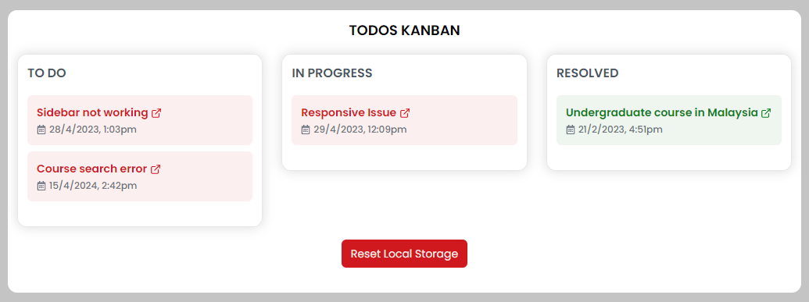

# Todos Kanban Board


A simple Kanban board built with React and `react-beautiful-dnd` for managing tasks. This project supports drag-and-drop functionality and localStorage for persistent state.

## Features

- **Drag-and-Drop**: Move tasks between columns or reorder them within the same column.
- **Persistent State**: Tasks are saved in `localStorage`, so they remain after page refresh.
- **Reset Functionality**: Reset the board to its initial state.

## Technologies Used


- **React**
- **react-beautiful-dnd**
- **Lodash** for deep cloning
- **Tailwind CSS** for styling

## Installation

1. Clone the repository:
   ```bash
   git clone https://github.com/gagan-official/siec-todokanban
   ```
2. Navigate to the project directory:
   ```bash
   cd siec-todokanban
   ```
3. Install dependencies:
   ```bash
   yarn
   ```
4. Run the development server:
   ```bash
   yarn dev
   ```

## Usage

- Drag and drop tasks to reorganize them.
- Tasks are automatically saved in `localStorage`.
- Click the "Reset Local Storage" button to clear the board and return to the default state.

## Contributing

Contributions are welcome! Please open an issue or submit a pull request.

## License

This project is licensed under the MIT License.
